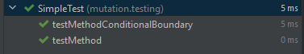
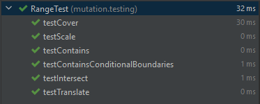
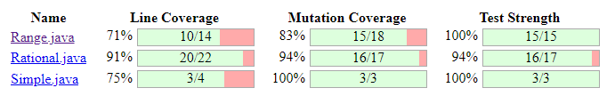

# mutation testing example

Analyze the `class Rational` (and fix the test cases to _kill all mutants_ generted by <http://pitest.org>)

## mvn goals

```
mvn clean
mvn test-compile org.pitest:pitest-maven:mutationCoverage 
```

## reports

Are to be found in [target/pit-reports](./target/pit-reports)

## Active mutate tester

- CONDITIONALS_BOUNDARY: ersetzt relational operators
- EMPTY_RETURNS: empty values return
- FALSE_RETURNS: booleab returns false
- INCREMENTS: mutates increments zB. 1++ wird zu 1--
- INVERT_NEGS: invertiert negationen -i -> i
- MATH: ersetzt operatoren
- NEGATE_CONDITIONALS: negiert conditional == -> !=
- NULL_RETURNS: returned null
- PRIMITIVE_RETURNS: returns 0
- TRUE_RETURNS: returns boolean with true

## Simple

Conditional Boundary: fixed with testing the < operator

    @Test
    public void testMethodConditionalBoundary(){
        var simple = new Simple();
        assertEquals(10L, simple.test(10L));

    }





## Range

Covered conditional boundary with tests:

        public void testContainsConditionalBoundaries() {
            assertTrue(new Range(1L, 3L).contains(3L));
            assertTrue(new Range(1L, 3L).contains(1L));
    }



