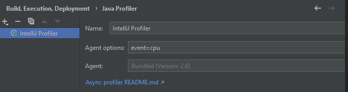
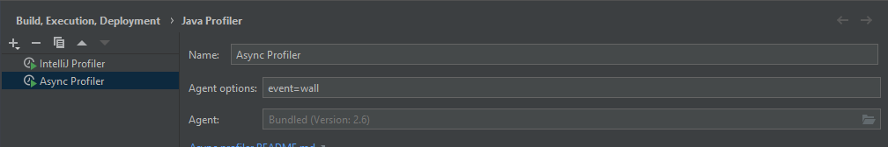
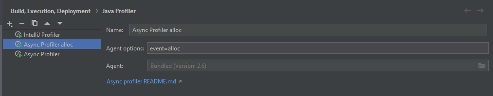
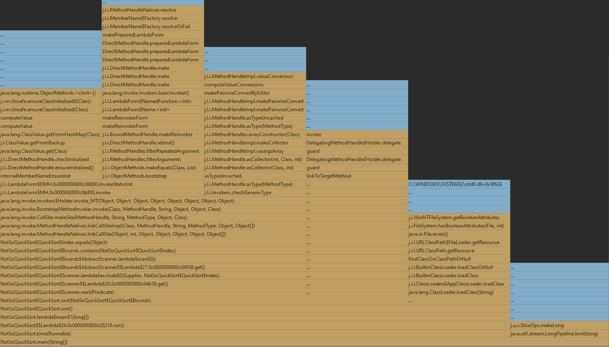
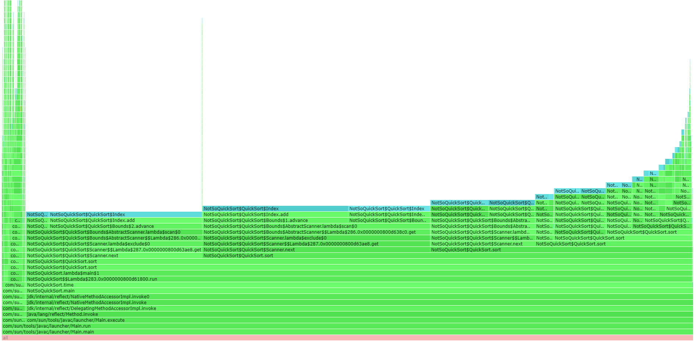
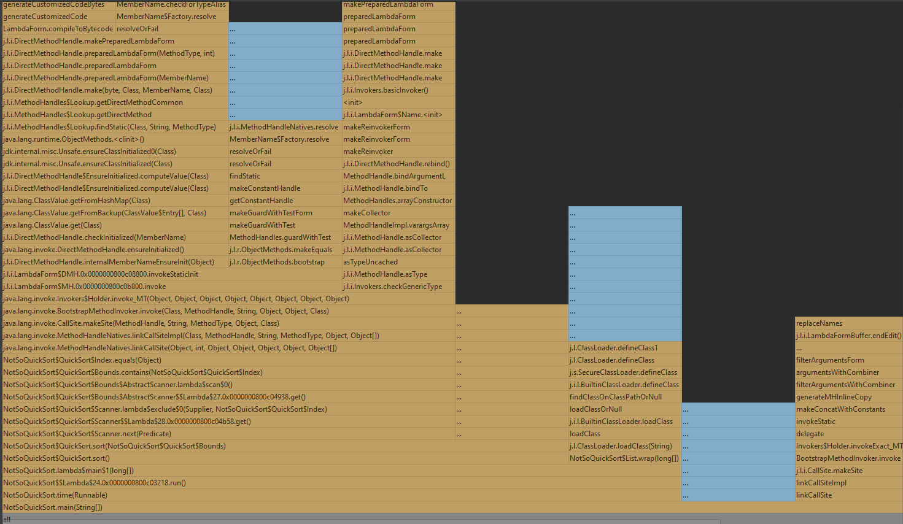

# NotSoQuickSort Profiling

Profiling mit IntelliJ auf Windows 10.

## Konfiguration

### Cpu - nur cpu
 

### Wall-Clock - alle threads
 

### Allocation - nur memory
 
 

## 1. Wall-Clock

## 2. Allocation

AllocTracer is not supported for Windows. WSL stattdessen:

## 3. Cpu

## Bemerkungen

Je größer die Liste, umso mehr stack traces gibt es.
Es werden mehr sort() und next() methoden aufgerufen.

## Ergebnis

